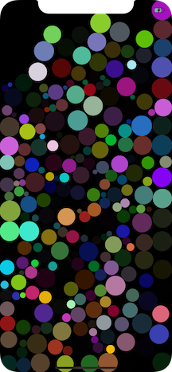

# Slime App

## Goals
A fun visual app that uses motion control, swift, and no storyboards

## Current status
App will open in simulator, create 400 random color views and drop them from the top of the screen with some variation. They bounce and collide.

Now, we have a lot of colored views all over

Here's what we had on the first day

## Contribute
PRs open
**you need to change the app ownership to you to run it on your machine -- do not commit that**

### Ideas for contribution
1. Make the slime continue to move, disappear, or start over once it stops
2. make the slime stay in the screen when the screen rotates
3. make different kinds of slime with different animations
4. put some slimes in front of others

## License
GNU GPL 3.0
;tldr - you can use this and distribute publicly (no selling)
